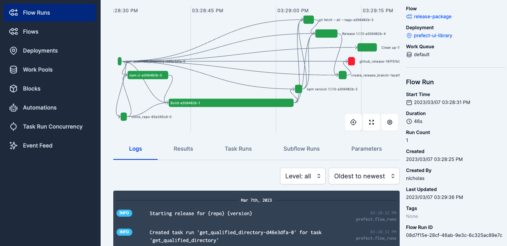

# **Welcome to Prefect:** The easiest way to orchestrate and observe your Python code

Prefect enables you to build resilient data workflows so that you can understand, react to, and recover from unexpected changes.

Bring your Python code, sprinkle in a few decorators, and go!

With Prefect you gain easy:

<ul class="ul-line-height-compress">
    <li> <a href="/concepts/schedules"> scheduling </a> </li>
    <li> <a href="/concepts/tasks/#task-arguments"> retries </a> </li>
    <li> <a href="/concepts/logs/"> logging </a> </li>
    <li> <a href="/concepts/tasks/#caching"> caching</a> </li>
    <li> <a href="/concepts/task-runners/#task-runners"> async</a> </li>
    <li> <a href="/ui/notifications/"> notifications</a> </li>
    <li> <a href="/ui/overview/"> observability</a> </li>
</ul>

Trying to implement these features from scratch is a huge pain that takes time, headaches, and money. That's why Prefect offers all this functionality and more! 

<figure markdown>

<figcaption>Prefect UI</figcaption>
</figure>

---

## Quick Start: Hello Prefect

In your Python virtual environment, install Prefect with 

<div class="terminal">
```bash
pip install -U prefect
```
</div>

See the [install guide](/getting-started/installation/) for more detailed instructions, if needed.

### Run a basic flow

Import `flow` and decorate your Python function using the [`@flow`][prefect.flows.flow] decorator.

```python hl_lines="1 3"
from prefect import flow

@flow
def my_favorite_function():
    print("What is your favorite number?")
    return 42

print(my_favorite_function())
```

Run the code and you should see output like this:

<div class="terminal">
```bash
$ python hello_prefect.py
15:27:42.543 | INFO    | prefect.engine - Created flow run 'olive-poodle' for flow 'my-favorite-function'
15:27:42.543 | INFO    | Flow run 'olive-poodle' - Using task runner 'ConcurrentTaskRunner'
What is your favorite number?
15:27:42.652 | INFO    | Flow run 'olive-poodle' - Finished in state Completed()
42
```
</div>

The Prefect orchestration engine observes the flow run state and saves it for you in a database. By adding a single decorator, you now have observation capabilities. There's much more you can do with Prefect, so keep rolling to learn how to add easy retries, notifications, scheduling and more!

---

## Next Steps

If you're learning Prefect we encourage you to work through the [tutorial](/tutorial/index/) where you'll create a full data project, jump into Prefect [concepts](/concepts/index/), or explore the [guides](guides/index/) for common use cases. 


[Tutorials](/tutorials/index/){ .md-button .md-button--primary .full}  [Concepts](/concepts/index/){ .md-button .full }  [Guides](guides/index/){ .md-button .full }

---

## Community

- Join over 25,000 engineers in the [Prefect Slack community](https://prefect.io/slack)
- Get help in [Prefect Discourse](https://discourse.prefect.io/) - the community-driven knowledge base
- [Give Prefect a ⭐️ on GitHub](https://github.com/PrefectHQ/prefect) 

---

!!! tip "Changing from 'Orion'"
    With the 2.8.1 release, **we removed references to "Orion" and replaced them with more explicit, conventional nomenclature throughout the codebase**. These changes clarify the function of various components, commands, and variables. See the [Release Notes](https://github.com/PrefectHQ/prefect/blob/main/RELEASE-NOTES.md#release-281) for details.

!!! help "Looking for Prefect 1 Core and Server?"
    Prefect 2 is now available for general use. See our [Migration Guide](guides/migration-guide/) to move your flows from Prefect 1 to Prefect 2.

    [Prefect 1 Core and Server documentation](http://docs-v1.prefect.io/) is available at [http://docs-v1.prefect.io/](http://docs-v1.prefect.io/).